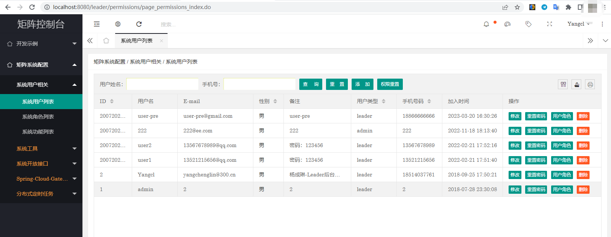

# Matrix-Distributed-Framework

对power-matrix的深度改进版本，基于Dubbo的微服务技术中台核心底层，致力于为中大型企业快速构建庞大、健壮的微服务生态环境。

## 功能描述

拥抱云原生，深度结合KubeSphere

基于第二代Spring Cloud微服务技术迭代与改进

基于Spring-Cloud-Gateway的开放网关

多级缓存封装，无侵入的缓存化管理模块(已封装Redis和Ehcache)，Half-Open设计理念诞生的缓存获取方式

基于配置的项目结构

基于org.quartz-scheduler再次封装的分布式定时任务管理模块

灵活且完整的用户权限体系

websocket页面消息通知功能

开放API接口能力(配置方式)

严谨且苛刻的高质量源代码，丰富的注释

接口幂等性控制(Idempotent)、lombok与代码简化应用


## 访问方式

http://localhost:8080/leader/login.html





## 差异化环境配置

您需要配置如下host文件，以便对应正确的差异化环境信息。

### beta环境示例

```bash
192.168.254.133 mdf-beta-mysql-service-inner.mdf-beta
192.168.254.133 mdf-beta-redis-service-inner.mdf-beta
192.168.254.133 mdf-beta-nacos.mdf-beta
```

### pre环境示例

```bash
192.168.254.133 mdf-pre-mysql-service-inner.mdf-pre
192.168.254.133 mdf-pre-redis-service-inner.mdf-pre
192.168.254.133 mdf-pre-nacos.mdf-pre
```

### prod环境示例

```bash
192.168.254.133 mdf-prod-mysql-service-inner.mdf-prod
192.168.254.133 mdf-prod-redis-service-inner.mdf-prod
192.168.254.133 mdf-prod-nacos.mdf-prod
```


